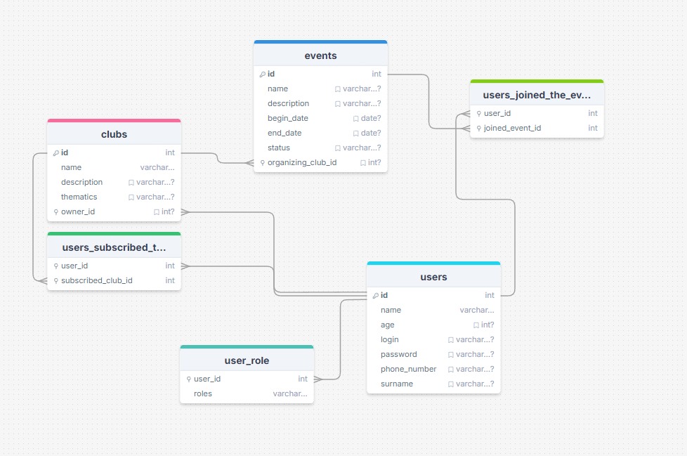

убрать data в сущностях
полностью переделать работу с эксепшенами
фильтры на даты
СДЕЛАТЬ СТАТУСЫ ДЛЯ ИВЕНТА ЧЕРЕЗ ENUM!!!
почистить сущности
сделать правильно импорты без *
сделать общий метод для всех пагинаций
в дто сделать правильную валидацию
апдейт методы для каждой сущности
сделать тесты, там сям
сделать так, чтобы админ мог изменять информацию любых клубов, ивентов и юзеров (кроме емайл и пароля)
сделать проверку при изменении информации, что это либо админ, либо хозяин (@IsAdminOrCreator)
упростить секьюрити
методы для изменения пароля и логина юзера
переделать логи
## Java Spring REST приложение   
<hr>

Проект представляет собой веб-сервис для помощи в организации общественных мероприятий. 

Пользователи могут организовывать клубы и мероприятия, подписываться на чужие клубы и присоединяться к их мероприятиям.
Также пользователям доступен профиль со всей информацией о них, которую они могут редактировать.
Администраторы имеют возможность редактировать и удалять любые клубы, а также изменять данные профиля пользователя.

Также реализованы регистрация и авторизация.

#### Технологии использованы:
- Java 11
- Spring MVC
- Spring Boot
- Spring Security
- Spring REST
- Logback
- MySQL
- Hibernate
- Liquibase
- Gradle
- Lombok
- Docker
<hr>

### Схема бд



<hr>

### Инструкция по установке и упаковке в Docker контейнер:

#### 1) Клонирование репозитория

```
git clone https://github.com/neHAILVOODOO/EventsOrganizer.git
```
```
cd EventsOrganizer
```
#### 2) Установка mysql image и контейнера БД

```
docker pull mysql  
```
```
docker run -p 3307:3306 --name sqlcont --net docknet -e MYSQL_ROOT_PASSWORD=bestuser -e MYSQL_DATABASE=eventsorganizer_db -d mysql
```

#### 3) Упаковка программы в контейнер и ее запуск:

```
docker build -t eventsorganizer .
```

```
docker run -p 8080:8080 --name eventsorganizercont --net docknet -e MYSQL_HOST=sqlcont -e MYSQL_PORT=3306 -e MYSQL_DATABASE=eventsorganizer_db -e SPRING_DATASOURCE_USERNAME=root -e MYSQL_ROOT_PASSWORD=bestuser  -e SPRING_DATASOURCE_URL=jdbc:mysql://sqlcont:3306/eventsorganizer_db  -d eventsorganizer
```
